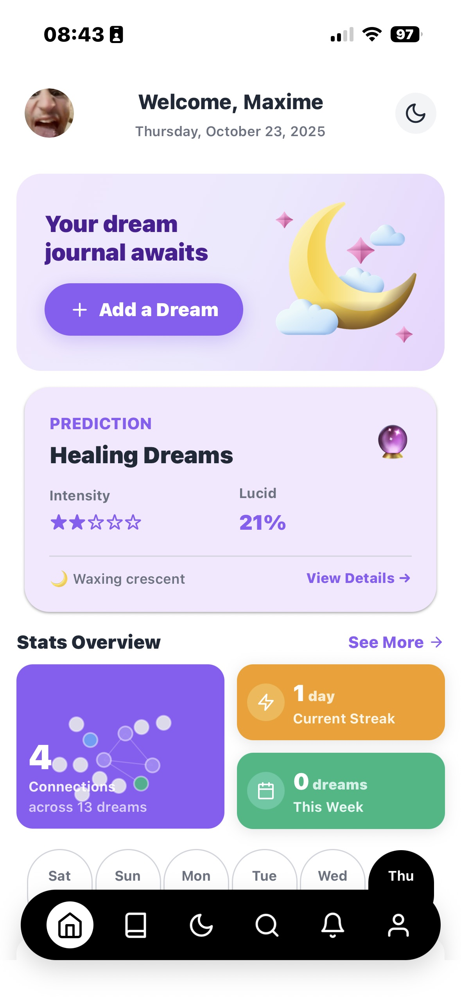
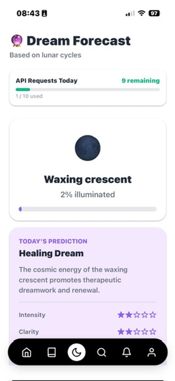
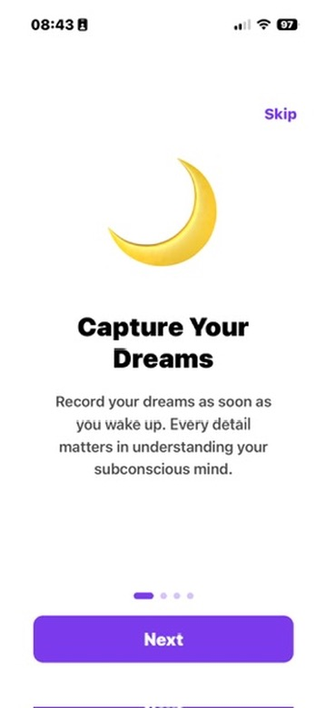
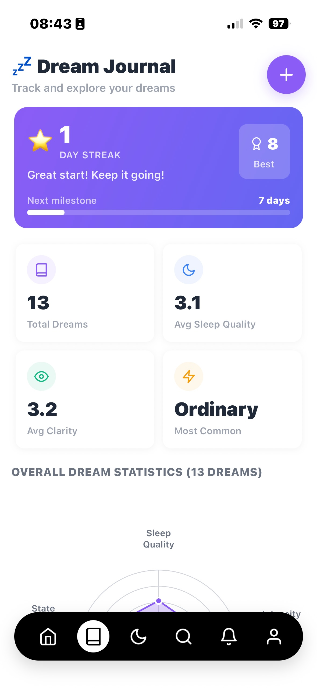

# Noctis 🌙

<div align="left">
  
  <p><em>Une application moderne de journal de rêves construite avec React Native et Expo</em></p>
  
  <p>
    <a href="#fonctionnalités">
      
    </a>
    <a href="#démarrage">
      
    </a>
    <a href="#démarrage">
      
    </a>
    <a href="#démarrage">
      
    </a>
    <a href="#licence">
      
    </a>
  </p>
</div>

## Table des matières

1. [Aperçu](#-aperçu)
2. [Fonctionnalités](#-fonctionnalités)
3. [Analytique des rêves](#-analytique-des-rêves)
4. [Structure du projet & Architecture](#-structure-du-projet--architecture)
5. [Démarrage](#-démarrage)
6. [Design UI/UX](#-design-uiux)
7. [Implémentation technique](#-implémentation-technique)
8. [API StormGlass & CI/CD](#-api-stormglass--cicd)
9. [Développement futur pour BTS SIO](#-développement-futur-pour-bts-sio)
10. [Licence](#-licence)
11. [Contribution](#-contribution)

## 📱 Aperçu

Noctis est une application de journal de rêves qui permet aux utilisateurs d'enregistrer, d'analyser et d'explorer leurs rêves. L'application propose des analyses avancées, des prévisions de rêves basées sur les cycles lunaires, et un système de recherche complet — tout en gardant vos données privées sur votre appareil.

<div align="left">
  
</div>

## ✨ Fonctionnalités

### 🎨 Expérience utilisateur élégante
- **Onboarding** : Introduction informative avec animations fluides de type carrousel
- **Thèmes sombre & clair** : Expérience visuelle entièrement personnalisable
- **Navigation intuitive** : Navigation par onglets en bas avec animations personnalisées
- **Support multilingue** : Internationalisation avec i18next

### 📝 Journal de rêves
- **Saisie rapide de rêves** : Enregistrez facilement vos rêves avec saisie textuelle et vocale
- **Classification des types de rêves** : Catégorisez les rêves (lucide, cauchemar, récurrent, etc.)
- **Suivi des émotions** : Enregistrez et analysez les états émotionnels dans les rêves
- **Visualisation des rêves** : Graphiques de type Kiviat pour visualiser les attributs des rêves
- **Suivi des séries** : Motivation par le suivi des séries d'enregistrements de rêves

### 🔮 Prévisions de rêves lunaires
- **Suivi des phases lunaires** : Affichage visuel de la phase lunaire actuelle
- **Prédiction de rêves** : Prévisions basées sur les cycles lunaires
- **Données astronomiques** : Données complètes sur la lune et le soleil
- **Conseils pour les rêves** : Conseils contextuels basés sur les conditions lunaires

### 🔍 Recherche et analyse avancées
- **Recherche puissante** : Trouvez des rêves par contenu, type, date, et plus
- **Système de filtrage** : Filtrage multi-facettes avec interface intuitive
- **Analyse statistique** : Représentation visuelle des modèles de rêves au fil du temps
- **Données exportables** : Exportez votre journal de rêves pour sauvegarde ou analyse

### 🏆 Réalisations
- **Gamification** : Système de récompenses pour encourager la tenue régulière du journal
- **Statistiques** : Suivez votre parcours de journalisation des rêves avec des statistiques détaillées

### 📱 Excellence technique
- **Priorité hors-ligne** : Fonctionne complètement sans connexion internet
- **Axé sur la confidentialité** : Toutes les données stockées localement sur l'appareil
- **Design responsive** : Fonctionne sur toutes les tailles d'écran
- **Optimisation des performances** : Expérience fluide même avec des journaux volumineux

## 📊 Analytique des rêves

Noctis fournit des analyses puissantes pour vous aider à comprendre les modèles de vos rêves :

<div align="left">
  
</div>

- **Distribution des types de rêves** : Visualisez les types de rêves que vous avez
- **Suivi des émotions** : Analysez les modèles émotionnels dans les rêves
- **Tendances mensuelles** : Suivez la fréquence et la qualité des rêves au fil du temps
- **Progression de la lucidité** : Suivez vos progrès en matière de rêves lucides

## 🏗️ Structure du projet & Architecture

Noctis est construit avec une architecture moderne et maintenable :

### Stack technologique
- **Framework** : React Native avec Expo
- **Navigation** : Expo Router (routage basé sur les fichiers)
- **Style** : NativeWind (Tailwind CSS pour React Native)
- **Gestion d'état** : API Context de React
- **Stockage** : AsyncStorage pour la persistance locale
- **Internationalisation** : i18next
- **Composants UI** : Composants personnalisés avec animations Reanimated

### Principes architecturaux clés

1. **Encapsulation des composants** : Chaque domaine fonctionnel a des dossiers de composants dédiés
2. **Logique basée sur les services** : Logique métier encapsulée dans des modules de service
3. **Gestion d'état basée sur Context** : API Context de React pour le partage d'état
4. **Routage basé sur les fichiers** : Expo Router pour une navigation déclarative
5. **Données d'abord locales** : Toutes les données stockées localement sur l'appareil
6. **Sécurité des types** : Système de typage TypeScript complet

### Structure du projet

```
noctis/
├── app/                         # Pages Expo Router
│   ├── (auth)/                  # Écrans d'authentification
│   ├── (tabs)/                  # Onglets principaux de l'app
│   ├── dreams/                  # Écrans de détail des rêves
│   └── _layout.tsx              # Layout racine
├── components/                  # Composants UI réutilisables
│   ├── achievements/            # Composants de réalisations
│   ├── auth/                    # Composants d'authentification
│   ├── dreams/                  # Composants du journal de rêves
│   ├── forecast/                # Composants de prévision lunaire
│   ├── home/                    # Composants d'écran d'accueil
│   ├── notifications/           # Composants de notifications
│   ├── profile/                 # Composants de profil
│   ├── search/                  # Composants d'interface de recherche
│   └── settings/                # Composants de paramètres
├── services/                    # Logique métier et services
├── types/                       # Définitions de types TypeScript
└── utils/                       # Fonctions utilitaires
```

## 🚀 Démarrage

### Prérequis

- Node.js (v16 ou plus récent)
- npm ou yarn
- Expo CLI

### Installation

1. **Cloner le dépôt**
   ```bash
   git clone https://github.com/AirKyzzZ/noctis.git
   cd noctis
   ```

2. **Installer les dépendances**
   ```bash
   npm install
   ```

3. **Démarrer le serveur de développement**
   ```bash
   npm start
   ```

### Exécution sur les appareils

```bash
# Simulateur iOS
npm run ios

# Émulateur Android
npm run android

# Web
npm run web

# Appareil physique
# Scanner le code QR depuis l'application Expo Go
```

## 🎨 Design UI/UX

### Philosophie de design

Noctis adopte une philosophie de design centrée sur ces principes fondamentaux :

1. **Esthétique nocturne** : Le design de l'application s'inspire du ciel nocturne et de l'état de rêve, avec des dégradés profonds, des effets lumineux subtils, et des éléments célestes.

2. **Clarté dans la complexité** : Bien que les rêves puissent être complexes, l'interface reste claire et concentrée, rendant facile la capture et l'exploration des expériences oniriques.

3. **Expérience adaptative** : L'UI s'adapte à différents appareils et préférences utilisateur avec des thèmes personnalisables et des options d'accessibilité.

### Palette de couleurs

#### Thème sombre (par défaut)
- **Arrière-plan primaire** : Bleu indigo profond (#121225)
- **Arrière-plan secondaire** : Bleu légèrement plus clair (#1E1E3A)
- **Accent** : Violet vibrant (#8A2BE2)
- **Texte primaire** : Blanc (#FFFFFF)
- **Texte secondaire** : Gris clair (#D1D5DB)

#### Thème clair
- **Arrière-plan primaire** : Blanc cassé (#F8FAFC)
- **Arrière-plan secondaire** : Blanc (#FFFFFF)
- **Accent** : Violet profond (#7C3AED)
- **Texte primaire** : Presque noir (#1E293B)
- **Texte secondaire** : Gris foncé (#4B5563)

#### Codage couleur des types de rêves
- **Normal** : Bleu (#3B82F6)
- **Lucide** : Violet (#8B5CF6)
- **Cauchemar** : Rouge (#EF4444)
- **Récurrent** : Turquoise (#14B8A6)
- **Prophétique** : Or (#EAB308)
- **Rêverie** : Bleu ciel (#0EA5E9)

### Typographie

Noctis utilise la famille de polices Proxima Nova avec une échelle typographique harmonieuse :
- H1 : 32px (2rem)
- H2 : 24px (1,5rem)
- H3 : 20px (1,25rem)
- Corps : 16px (1rem)
- Petit : 14px (0,875rem)

### Présentation des écrans

> Remarque : Les captures d'écran montrent l'application actuelle.

#### Bienvenue & Onboarding

<div align="left">
  
</div>

**Choix de design :**
- **Approche carrousel** : Divulgation progressive des fonctionnalités clés
- **Narration visuelle** : Chaque écran utilise des icônes pour transmettre l'objectif
- **Texte minimal** : Contenu concis expliquant les propositions de valeur

#### Écran d'accueil

<div align="left">
  
</div>

**Choix de design :**
- **Actions rapides** : Bouton d'ajout de rêve mis en évidence
- **Cartes d'aperçu** : Statistiques résumées et rêves récents
- **Calendrier hebdomadaire** : Suivi visuel de la fréquence des rêves

#### Journal de rêves

<div align="left">
  
</div>

**Choix de design :**
- **Mise en page basée sur des cartes** : Chaque rêve comme une carte distincte
- **Étiquetage visuel** : Types de rêves codés par couleur
- **Vue d'ensemble statistique** : Métriques clés affichées de manière proéminente

#### Prévision des rêves

<div align="left">
  
</div>

**Choix de design :**
- **Visualisation lunaire** : Représentation visuelle précise de la phase lunaire actuelle
- **Carte de prévision** : Prédiction affichée de manière proéminente avec raisonnement
- **Données astronomiques** : Points de données clairement organisés

## 🔧 Implémentation technique

### Logique basée sur les services

L'application utilise une approche basée sur les services pour gérer la logique métier. Chaque domaine (rêves, notifications, etc.) possède un module de service dédié qui expose des fonctionnalités via des hooks React personnalisés.

Exemple de `DreamService.tsx` :

```typescript
// Service avec contexte
export const DreamContext = createContext<DreamContextType | undefined>(undefined);

export function DreamProvider({ children }: { children: React.ReactNode }) {
  // Implémentation...
  
  return (
    <DreamContext.Provider value={value}>
      {children}
    </DreamContext.Provider>
  );
}

// Hook pour la consommation par les composants
export function useDreams() {
  const context = useContext(DreamContext);
  if (context === undefined) {
    throw new Error('useDreams doit être utilisé à l'intérieur d'un DreamProvider');
  }
  return context;
}
```

### Composants clés

#### Composant DreamCard

Le composant `DreamCard` est un élément UI central qui affiche les entrées de rêves dans toute l'application :

```typescript
// Exemple simplifié de DreamCard.tsx
export const DreamCard: React.FC<DreamCardProps> = ({ 
  dream, 
  onPress, 
  onDelete 
}) => {
  const { colors } = useTheme();
  
  return (
    <Pressable 
      onPress={onPress}
      style={[
        styles.container, 
        { backgroundColor: colors.cardBackground }
      ]}
    >
      <View style={styles.header}>
        <Text style={[styles.date, { color: colors.textSecondary }]}>
          {formatDate(dream.dateTime)}
        </Text>
        
        <View style={styles.tagContainer}>
          <Text style={[styles.tag, { backgroundColor: getTypeColor(dream.type) }]}>
            {dream.type}
          </Text>
        </View>
      </View>
      
      <Text style={[styles.title, { color: colors.textPrimary }]} numberOfLines={2}>
        {dream.title || "Rêve sans titre"}
      </Text>
      
      <Text style={[styles.content, { color: colors.textSecondary }]} numberOfLines={3}>
        {dream.content}
      </Text>
      
      {/* Attributs et actions de rêve */}
    </Pressable>
  );
};
```

#### Graphique Kiviat pour la visualisation des rêves

L'une des fonctionnalités uniques est le graphique Kiviat qui visualise les attributs des rêves :

```typescript
// De DreamKiviatChart.tsx
export const DreamKiviatChart: React.FC<DreamKiviatChartProps> = ({
  dream,
  size = 200,
}) => {
  const { colors, isDark } = useTheme();
  
  // Calculer les points pour le polygone basé sur les attributs du rêve
  const getPolygonPoints = () => {
    // Implémentation...
  };
  
  return (
    <View style={{ width: size, height: size, alignItems: 'center' }}>
      <Svg width={size} height={size} viewBox={`0 0 ${size} ${size}`}>
        {/* Grille d'arrière-plan */}
        {/* Lignes d'axes d'attributs */}
        {/* Polygone représentant les attributs du rêve */}
        <Polygon
          points={getPolygonPoints()}
          fill={`${colors.accent}40`}
          stroke={colors.accent}
          strokeWidth="2"
        />
        {/* Étiquettes d'attributs */}
      </Svg>
    </View>
  );
};
```

### Gestion des données

Noctis utilise une approche "local-first" pour la gestion des données :

1. Toutes les données utilisateur sont stockées sur l'appareil avec AsyncStorage
2. Les données sont structurées par domaine (rêves, paramètres, etc.)
3. Sérialisation JSON pour le stockage d'objets

```typescript
// De types/dream.ts
export interface Dream {
  id: string;
  title: string;
  content: string;
  dateTime: string; // Format ISO
  type: DreamType;
  emotions: Emotion[];
  clarity: number; // 1-10
  vividness: number; // 1-10
  awareness: number; // 1-10
  control: number; // 1-10
  significance: number; // 1-10
  tags: string[];
  location?: string;
  people?: string[];
  images?: string[]; // Encodé en Base64 ou URIs de fichiers
  audioNotes?: string[]; // URIs de fichiers
}

export type DreamType = 
  | 'normal' 
  | 'lucid' 
  | 'nightmare' 
  | 'recurring' 
  | 'prophetic' 
  | 'daydream';
```

### Considérations de performance

1. **Gestion de la mémoire** : 
   - Redimensionnement des images avant stockage
   - Pagination des longues listes

2. **Optimisation du rendu** :
   - Mémoïsation des composants coûteux
   - Virtualisation des listes pour le défilement long
   - Chargement paresseux des écrans

3. **Efficacité du stockage** :
   - Structures de données compactes
   - Persistance sélective des données essentielles

## 🌊 API StormGlass & CI/CD

### Intégration de l'API StormGlass

Noctis utilise l'API StormGlass pour obtenir des données astronomiques précises qui alimentent la fonctionnalité de prévision des rêves basée sur les cycles lunaires.

#### Caractéristiques principales de l'implémentation :

- **Gestion efficace des quotas** : Limitation à 10 requêtes par jour pour respecter le plan gratuit de l'API
- **Système de mise en cache** : Les données astronomiques sont stockées localement pour minimiser les appels API
- **Rotation du cache** : Conservation des 30 derniers jours de données pour éviter la saturation de la mémoire
- **Réinitialisation quotidienne** : Le compteur de requêtes se réinitialise chaque jour
- **Gestion des erreurs** : Traitement robuste des échecs d'API avec retour aux données en cache

```typescript
// Extrait de stormglassApi.ts
export const fetchAstronomyData = async (
  apiKey: string,
  date?: string
): Promise<AstronomyData | null> => {
  const targetDate = date || getCurrentDate();

  // Vérifier d'abord le cache
  const cached = await getCachedAstronomyData(targetDate);
  if (cached) {
    return cached;
  }

  // Vérifier si nous pouvons faire une requête
  if (!(await canMakeRequest())) {
    console.warn('Limite quotidienne de requêtes API atteinte (10/10)');
    return null;
  }

  try {
    const url = `${STORMGLASS_API_URL}?lat=${BORDEAUX_LAT}&lng=${BORDEAUX_LNG}&end=${targetDate}`;
    
    const response = await fetch(url, {
      headers: {
        Authorization: apiKey,
      },
    });

    // Traitement de la réponse et mise en cache...
  } catch (error) {
    console.error('Erreur lors de la récupération des données astronomiques:', error);
    return null;
  }
};
```

### CI/CD avec GitHub Actions

Noctis utilise GitHub Actions pour l'intégration continue, garantissant la qualité du code à chaque commit et pull request.

#### Pipeline d'intégration continue :

- **Déclencheurs** : Exécution automatique sur les push et les pull requests vers les branches principales
- **Tests** : Exécution de la suite complète de tests unitaires et d'intégration
- **Vérification de types** : Validation TypeScript pour s'assurer de la cohérence du typage
- **Linting** : Application des règles ESLint pour garantir la cohérence du code
- **Optimisation des ressources** : Annulation des builds en cours quand un nouveau commit est poussé

```yaml
# Extrait du workflow GitHub Actions
name: CI

on:
  push:
    branches: ["main, develop"]
  pull_request:
    branches: ["main"]

concurrency:
  group: ${{ github.workflow }}-${{ github.ref }}
  cancel-in-progress: true

jobs:
  quality:
    name: Typecheck, Lint, Format, Tests (Node 20)
    runs-on: ubuntu-latest
    steps:
      - name: Checkout
        uses: actions/checkout@v4

      - name: Setup Node
        uses: actions/setup-node@v4
        with:
          node-version: 20
          cache: npm

      - name: Install dependencies
        run: npm ci

      - name: Typecheck
        run: npm run typecheck

      - name: Lint
        run: npm run lint

      - name: Tests
        run: npm test
```

Ce système CI/CD assure que chaque contribution au projet maintient les standards de qualité et préserve la stabilité de l'application à travers son cycle de développement.

## 🔮 Développement futur pour BTS SIO

Noctis est activement développé pour le programme **BTS SIO** (Brevet de Technicien Supérieur - Services Informatiques aux Organisations) avec plusieurs améliorations planifiées :

### Intégration Supabase

[Supabase](https://supabase.com/) est une alternative open-source à Firebase qui fournit une suite d'outils pour construire des applications modernes. Nous prévoyons d'intégrer Supabase pour fournir :

- Authentification avec plusieurs fournisseurs
- Synchronisation cloud pour accès multi-appareils
- Sauvegarde sécurisée des données
- Fonctionnalités sociales optionnelles

### Système d'authentification

La première phase de l'intégration Supabase se concentrera sur l'authentification des utilisateurs :

```typescript
// Implémentation future de AuthService
import { supabase } from './supabaseClient';

export const signUpWithEmail = async (email: string, password: string) => {
  const { data, error } = await supabase.auth.signUp({
    email,
    password,
  });
  
  if (error) throw error;
  return data;
};
```

### Conception du schéma de base de données

Le schéma de base de données PostgreSQL sera structuré pour prendre en charge toutes les fonctionnalités actuelles de l'application plus les améliorations futures :

```sql
-- Table des rêves
CREATE TABLE public.dreams (
  id UUID DEFAULT uuid_generate_v4() PRIMARY KEY,
  user_id UUID REFERENCES auth.users NOT NULL,
  title TEXT,
  content TEXT NOT NULL,
  date_time TIMESTAMPTZ NOT NULL,
  dream_type TEXT NOT NULL,
  emotions TEXT[] DEFAULT '{}',
  clarity INTEGER CHECK (clarity BETWEEN 1 AND 10),
  vividness INTEGER CHECK (vividness BETWEEN 1 AND 10),
  awareness INTEGER CHECK (awareness BETWEEN 1 AND 10),
  control INTEGER CHECK (control BETWEEN 1 AND 10),
  significance INTEGER CHECK (significance BETWEEN 1 AND 10),
  tags TEXT[] DEFAULT '{}',
  location TEXT,
  people TEXT[] DEFAULT '{}',
  is_public BOOLEAN DEFAULT FALSE,
  created_at TIMESTAMPTZ DEFAULT NOW(),
  updated_at TIMESTAMPTZ DEFAULT NOW()
);
```

### Fonctionnalités étendues

Avec l'intégration de Supabase, plusieurs nouvelles fonctionnalités deviendront possibles :

1. **Fonctionnalités sociales** (opt-in) :
   - Partage anonyme de rêves
   - Insights et modèles communautaires
   - Journaux de rêves collaboratifs

2. **Analyses avancées** :
   - Traitement du langage naturel pour l'analyse du contenu des rêves
   - Reconnaissance de modèles à travers le journal de rêves
   - Corrélation avec des facteurs externes

3. **Sécurité renforcée** :
   - Chiffrement de bout en bout pour le contenu sensible
   - Options d'authentification avancées
   - Contrôles complets de confidentialité des données

### Pertinence pour le projet BTS SIO

Le projet d'intégration Supabase pour Noctis s'aligne parfaitement avec les objectifs d'apprentissage du BTS SIO :

#### SLAM (Solutions Logicielles et Applications Métier)

- **Développement logiciel** : Développement d'applications full-stack
- **Développement mobile** : Expertise React Native et framework Expo
- **Méthodologies de test** : Tests unitaires, d'intégration et E2E
- **Gestion de projet** : Processus de développement Agile

### Calendrier d'implémentation

L'intégration est planifiée en trois phases :

1. **Fondation** (Mois 1-2) :
   - Configuration et configuration du projet Supabase
   - Implémentation du système d'authentification
   - Conception du schéma de base de données et stratégie de migration

2. **Fonctionnalités principales** (Mois 3-4) :
   - Intégration du stockage cloud pour les ressources de rêves
   - Mécanisme de synchronisation robuste avec résolution des conflits
   - Gestion des profils utilisateurs

3. **Fonctionnalités avancées** (Mois 5-6) :
   - Implémentation des fonctionnalités sociales
   - Intégration d'analyses avancées
   - Implémentation des fonctionnalités premium

## 📄 Licence

0BSD - Libre d'utilisation à toutes fins

## 🤝 Contribution

Les contributions sont bienvenues ! N'hésitez pas à soumettre une Pull Request.

---

<div align="left">
  <p>Construit avec 💜 et l'énergie de la 🌙 par Maxime Mansiet</p>
</div>